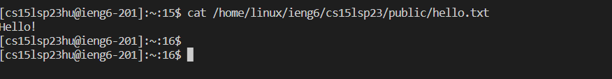
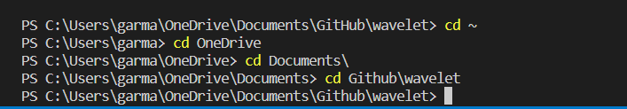

# Lab Report Week 1 : Remote Access and FileSystem

## 1. Downloading VS Code

* Click this link : [Link](https://code.visualstudio.com/)
* You should be taken to the page shown above.
* Click download, note there are different procedures depending on whether you are using a Mac or Windows.
* Once VS code is installed on your device, it should look like the picture below.
 
 
 
 New right? You'll get used to using a coding environment like this after some practice (possibly some grueling PAs). If you're a computer science major get ready to constantly have this tab open ! Thankfully, the layout of VS Code is easy to pick up quickly. This might just be me being a CS nerd, but I personally enjoy the layout of VS Code a lot! (I used linux for one of my classes, and it scarred me)
 
## 2. Remotely Connecting 
 
 * At the top of the VS code tab, you should see a button for Terminal. Click this button and choose "New Terminal"
 * The new terminal should open and look like the image below : 
 
 * Afterwards, type in "ssh" and your course specific account adress into the terminal like so : 
 
 * Proceed to log in with your password

 Be very careful when inputting your password into the terminal and make sure not to make a mistake ! Because a password is private, the characters of your password will not appear so if you make a mistake when typing in your password you won't be able to see it ! I had to change my password because I kept inputting it wrong ! Don't be like me haha. Write down your password somewhere safe so you don't forget it !
 * If you're able to log in with no problems, you're done ! Enjoy and code away !

## 3. Trying out commands 
 
 * Practicing is a great way to memorize commands! 
 * Some commands I would reccommend starting to familiarize yourself with are : 
    * pwd - “Print working directory” Used to display the current working directory (according to Monday Lecture Professor Politz cse 15l handout)
    * ls - <path> - “List” Used to list the files and folders the given path (according to Monday Lecture Professor Politz cse 15l handout)
    * clear - clears terminal.
    * cat - "Concatenate" Used to print the contents of one or more files given by the path.
    * cd - "Change directory" Used to switch the current working directory to the given path.
 
 
 

 There are a lot of commands we can make use of when using VS Code. I highly reccomend using them, understandably it can be hard to imagine remembering all of these! But the only thing you can do is PRACTICE. Practice, practice and practice (yes really) Personally, the one I've used the most at this point is "cd". Remember in java, being on the right path is important. Oftentimes, I've tried to run my code and it has failed to run because it can't find the file! Keep in mind that if this happens it may mean that you're in the right folder, but not in the right file inside the folder, so using cd *file name* can fix this! However, not being familiar with commands at this point I spent an hour just staring at my screen and wondering why it wouldnt run teh code! (That's rough buddy). Then a tutor took a look and showed me how to use the cd command and it started running ! As you can see, this is a great example of why knowing terminal commands is so important !
 

 
 * Here you can see how I was ablle to use cd to get to the directory I wanted! 
 * However, after some commands you're terminal might feel crowded, use the clear command !
 
 
  
