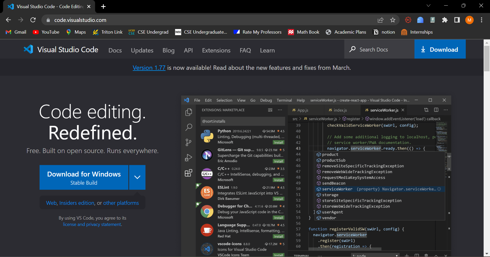
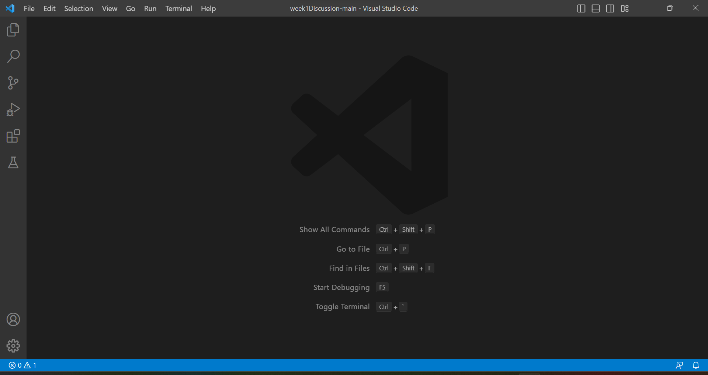
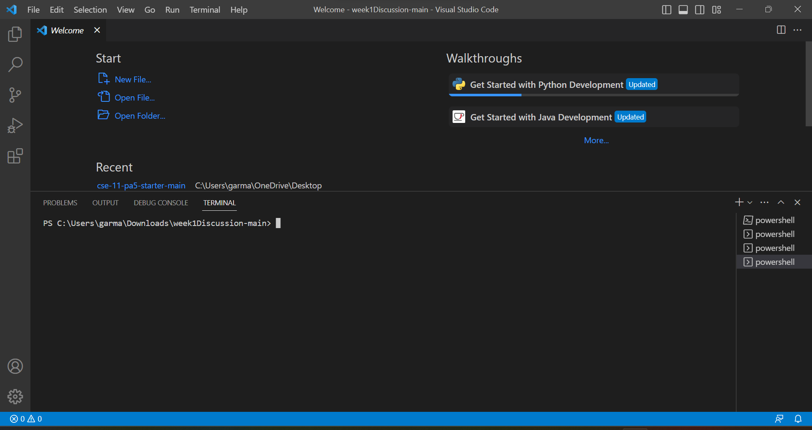
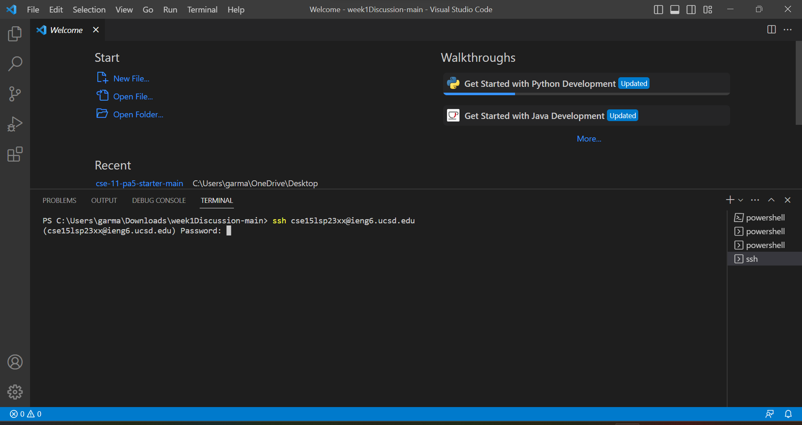
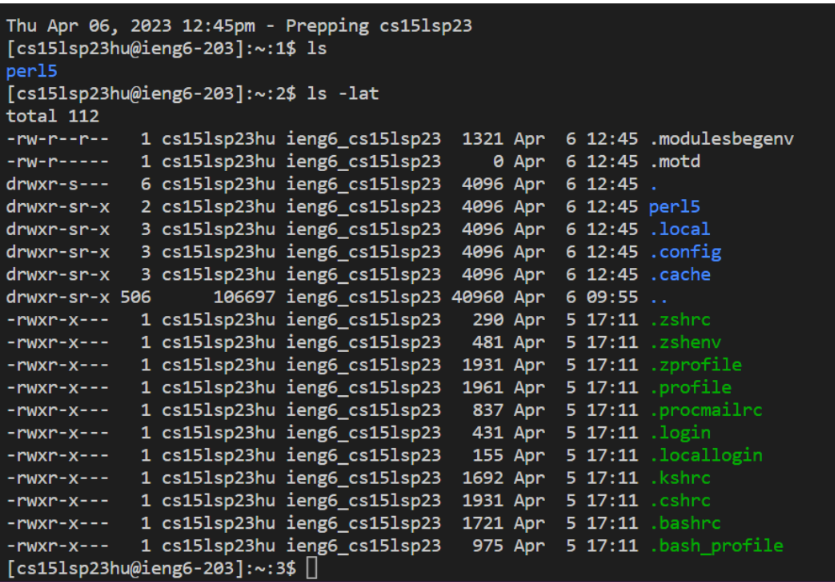

# Lab Report Week 1 : Remote Access and FileSystem

## 1. Downloading VS Code

* Click this link : [Link](https://code.visualstudio.com/)
* You should be taken to the page shown above.
* Click download, note there are different procedures depending on whether you are using a Mac or Windows.
* Once VS code is installed on your device, it should look like the picture below.
 
 
 
 ## 2. Remotely Connecting 
 
 * At the top of the VS code tab, you should see a button for Terminal. Click this button and choose "New Terminal"
 * The new terminal should open and look like the image below : 
 
 * Afterwards, type in "ssh" and your course specific account adress into the terminal like so : 
 
 * Proceed to log in with your password
 * You're done ! 

 ## 3. Trying out commands 
 
 * Practicing is a great way to memorize commands! 
 * Some commands I would reccommend starting to familiarize yourself with are : 
    * pwd - “Print working directory” Used to display the current working directory (according to Monday Lecture Professor Politz cse 15l handout)
    * ls - <path> - “List” Used to list the files and folders the given path (according to Monday Lecture Professor Politz cse 15l handout)
 
 
  
