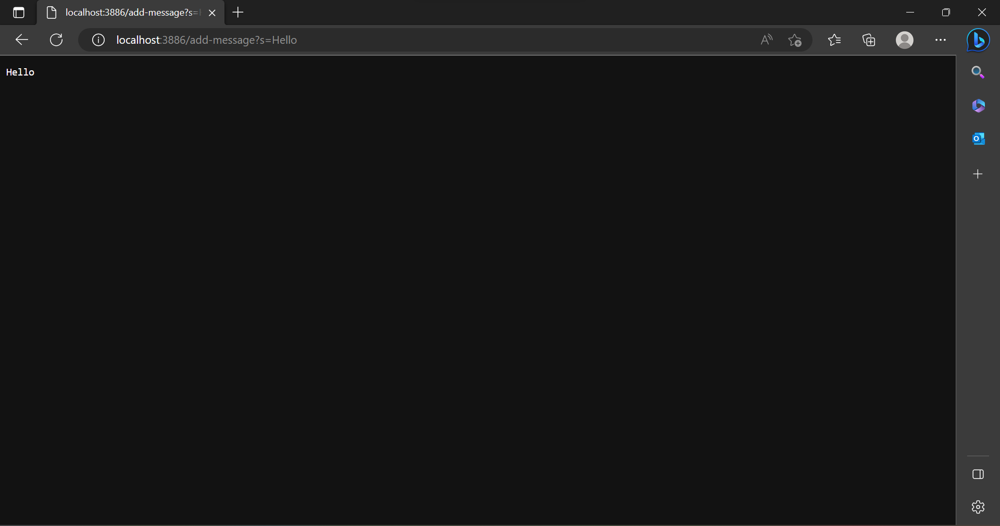
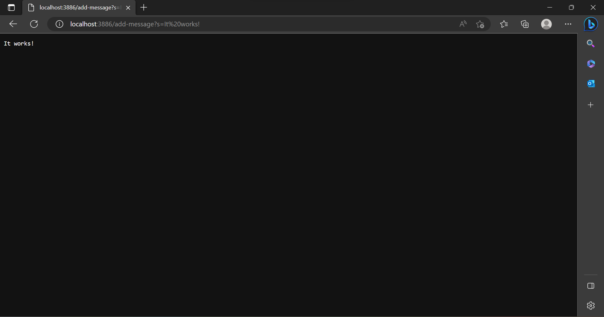
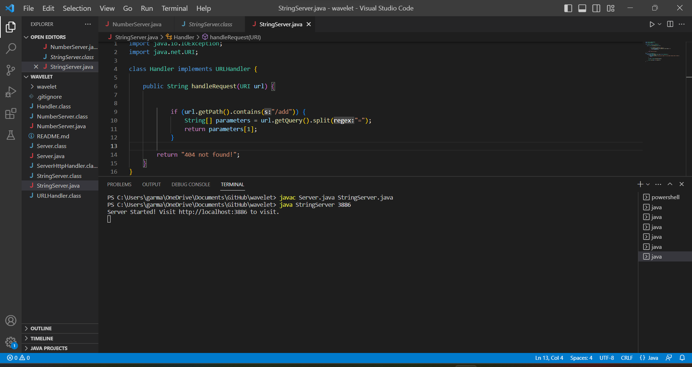
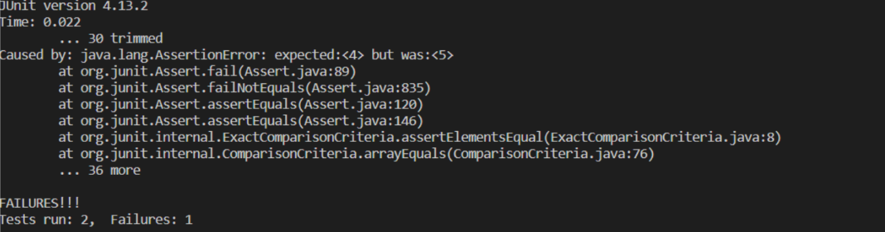

#CSE 15L Lab Report 2

## Part 1 

  
  
  
  
  
  
  In the code for the String Server, the if statement identifies the add command in the URL. Then, the next line of code finds the point of the query and saves that
  into an array *parameters*. The next line of code, the return line, alters the text on the server. 
  
## Part 2 
  
  The following JUnit test would cause an error in the faulty code : 
  
      ArrayExamples.reverseInPlace(input2);
      assertArrayEquals(new int[]{6,5,4,3},input2);

  An input that doesn’t induce a failure, as a JUnit test : 
  
      int[] input1 = { 3 };
      ArrayExamples.reverseInPlace(input1);
      assertArrayEquals(new int[]{ 3 }, input1);
     
  The symptom, as the output of running the tests (provide it as a screenshot of running JUnit with at least the two inputs above) : 
  
  
  
   
  The bug, as the before-and-after code change required to fix it (as two code blocks in Markdown)
  
  Code before : 
  
    static void reverseInPlace(int[] arr){
      for (int i = 0; i < arr.length; i += 1){
        arr[i] = arr[arr.length - i - 1]
      }
    }
    
  The issue that arises in the original buggy code is that since we aren't making a new array the loop will eventually "trip over itself" and cause the numbers
  at the end of the array to repeat.
  
  Code after : (fixed)
   
    static void reverseInPlace(int[] arr){
      int temp = arr[i]
      for (int i = 0; i < arr.length/2; i += 1){
        arr[i] = arr[arr.length - i - 1]
        arr[arr.length - i - 1] = temp;
      }
    }
  
  Here the code can now function properly because we will be essentially saving the beginning part of the array in the "temp" variable.
  
## Part 3

Before lab 2 and lab 3, I didn't know how to make a server at all. Also, although we had covered it in lecture I felt that making the server helped me better understand 
paths and the anatomy of URL. Lab 3 also served as good practice for debugging. 
